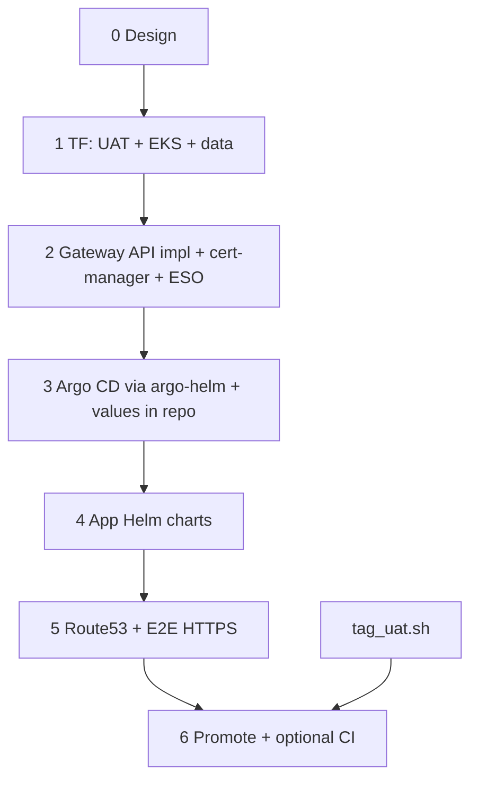

# UAT: Terraform, GitOps (Argo CD), DNS, SSL

Editable plan. Promotion uses `infra/01-run-qa/setup/tag_uat.sh` (not `prev-infra-example` scripts). K8s patterns: `prev-infra-example/infra/02-uat/`. **Apps** ship as **small Helm charts** (committed `Chart.yaml` + `values.yaml` + `templates/`) so you can diff and edit in git. **Argo CD** may be installed with the **official `argo-helm` chart** — the important part is **checked-in** `Chart.yaml` (or `umbrella` wrapper) and **`values.yaml`** (and any `values-uat.yaml` override), not a one-off `helm repo add` with no files in the repo.

### UAT public hostname (**Cloudflare** registrar + **Route 53** for UAT + certs + HTTPRoute)

**Split of responsibility**

| Piece | Where |
|--------|--------|
| **Domain / registrar** | **`ettukube.com` is in Cloudflare** — you add whatever **apex / NS / delegation** records you need (e.g. **delegate** `shmup.ettukube.com` to **Route 53** by pasting the child zone’s NS from AWS). That work stays **on your side**; it is not automated in this repo. |
| **UAT record** | **AWS Route 53 (Terraform in `infra/02-uat/terraform/`)** — e.g. a public hosted zone for **`shmup.ettukube.com`**, then **`aws_route53_record`** for **`uat.shmup.ettukube.com`** (CNAME or **ALIAS** to the **Gateway / load-balancer** hostname from EKS). After delegation, the public name resolves via **Route 53**, not via a manual CNAME in the Cloudflare UI for that FQDN. |

`uat_fqdn` defaults to **`uat.shmup.ettukube.com`** in TF for **Helm, cert-manager, and `HTTPRoute`** in-cluster, and for the **Route 53** record `name` / FQDN (match your zone’s `name` + `type` to the [Route 53 data model](https://registry.terraform.io/providers/hashicorp/aws/latest/docs/resources/route53_record)).

### Edge traffic: **Gateway API** (not classic `Ingress` / not Ingress NGINX)

UAT standardizes on the **[Gateway API](https://gateway-api.sigs.k8s.io/)** — `GatewayClass`, a shared **`Gateway`**, and per-app **`HTTPRoute`** (see [guides](https://gateway-api.sigs.k8s.io/guides/)). You still install a **concrete implementation** (controller + CRD bundle); pick and pin one (common on EKS, for example: **[Envoy Gateway](https://gateway.envoyproxy.io/)**, Cilium Gateway, Kong, or another controller that speaks Gateway API). App charts expose traffic with **`HTTPRoute`**, not `Ingress` resources on the main path. Optional **`helm/.../platform`**: shared `Gateway` / listeners / issuer wiring.

[Ingress NGINX is retired for new work](https://kubernetes.io/blog/2025/11/11/ingress-nginx-retirement/) (no security fixes after **March 2026**). `prev-infra-example` assumed **Ingress + NGINX**; replace with Gateway API and **cert-manager** patterns that target **`Gateway`** (see [cert-manager Gateway](https://cert-manager.io/docs/usage/gateway/)) instead of the old `Ingress` + `nginx` annotations.

---

## Goals

| Area        | Target |
|------------|--------|
| **Promotion** | `tag_uat.sh` + `qa_images.txt` → ECR pointer tag `uat-latest` (immutable source tags unchanged). |
| **IaC**       | New UAT stack in Terraform; align with `prev-infra-example/infra/02-uat/terraform` — do not copy old example TF blindly. |
| **DNS**       | **Cloudflare:** `ettukube.com` + **delegation** to Route 53 for the **shmup** (or your chosen) subzone (you). **Route 53 (this repo’s TF):** hosted zone + **`aws_route53_record`** for **`uat.shmup.ettukube.com` →** Gateway/LB. |
| **TLS + edge** | **Gateway API**; cert-manager and/or ACM with **SNI / host** **`uat.shmup.ettukube.com`**. Parameterize ACME contact email. (If the implementation uses **ACM** for the cloud LB, keep app routes on Gateway API.) |
| **Manifests** | Port from `prev-infra-example/infra/02-uat/k8s/` into **simple per-service (or per-domain) Helm charts**; default tag **`uat-latest`** via `values.yaml` (or digests if you lock later). |
| **Argo CD**  | Install from **`argo-helm`** with a **version-pinned** dependency and **all overrides in this repo** (`values.yaml`); `Application` / app-of-apps points at the app chart path(s) or umbrella chart. |

---

## Dependency order

1. **Design** — **FQDN is `uat.shmup.ettukube.com`**; **Cloudflare** for `ettukube.com` + **NS delegation** to **Route 53** (you); **Route 53** module in TF for the UAT record. CIDR, EKS version, new VPC vs shared.
2. **Terraform** — UAT network + EKS (+ RDS if needed, IAM) + **Route 53** (zone for `shmup.ettukube.com` or equivalent + record for `uat.shmup.ettukube.com`).
3. **K8s platform** — **Gateway API implementation** (CRDs + controller) + **cert-manager** + **External Secrets** (Helm and/or raw manifests; version-pin and commit `values`).
4. **Argo CD** — `argo-helm` chart: committed **`argocd/Chart.yaml` + `argocd/values.yaml`** (and env overrides as needed); `helm dependency build` or equivalent so installs are reproducible.
5. **App Helm** — one chart per logical service (or a thin umbrella): port `prev-infra-example/.../k8s/*` into `templates/`; wire images/tags, **hostnames, and `HTTPRoute`** (parent `Gateway` refs) via values.
6. **Cloudflare delegation** (if not done) + **Route 53** record applied + HTTPS smoke.
7. **CI / runbooks** — `tag_uat.sh`, optional `argocd app sync`, `helm template` / lint in pipeline optional.

*Note: `tag_uat.sh` can be run while the cluster is building; public UAT needs **Gateway** + DNS + TLS.*



---

## Subagent 1 — Terraform: `infra/02-uat` (name TBD)

- **Networking:** VPC (dedicated CIDR) or document shared-VPC choice.
- **EKS:** `terraform-aws-modules/eks` (version pinned); node groups sized for your workloads.
- **Data:** Port RDS from prev example if UAT needs Postgres; password via SSM/Secrets Manager.
- **Route 53:** **`aws_route53_zone`** (e.g. **`shmup.ettukube.com`**) and **`aws_route53_record`** for **`uat.shmup.ettukube.com`** (ALIAS to ELB/NLB/hostname from the **Gateway** implementation, or CNAME to the public LB DNS name) — `name` / `zone_id` from variables or `data` sources; **`var.uat_fqdn`** = `uat.shmup.ettukube.com`. In **Cloudflare (you):** at the `ettukube.com` level, **NS** for `shmup` (or the delegated label) **→ Route 53** name servers for that hosted zone, so the chain resolves.
- **Outputs:** `cluster_name`, kubeconfig, **`uat_fqdn`**, **nameservers** for the Route 53 child zone (for pasting into Cloudflare), and the **LB hostname** the record should target.
- **IAM / IRSA:** roles for External Secrets, cert-manager (if DNS-01 later), Argo, and the **Gateway implementation** if it creates AWS LBs (depends on which controller you pick).

**Handoff:** `terraform output` + one-liner for `aws eks update-kubeconfig`.

---

## Subagent 2 — K8s platform: Gateway API, cert-manager, ESO

- **Gateway API stack:** Install **Gateway API CRDs** (version aligned with the implementation) + one **controller** (Envoy Gateway, Cilium Gateway, etc. — *decide in [Open decisions](#open-decisions-fill-in-before-main-tf-pr))*. Create a **cluster- or env-level `Gateway`** (and `GatewayClass` binding) and prove traffic with a smoke **`HTTPRoute`**. **Not** [Ingress NGINX](https://kubernetes.io/blog/2025/11/11/ingress-nginx-retirement/); **not** the old `Ingress` + `cert-manager.io/cluster-issuer` on nginx-only paths unless you have a **Gateway → Ingress** bridge you document (prefer native Gateway routes).
- **cert-manager:** `ClusterIssuer` (Let’s Encrypt) + **`Certificate` / solvers** compatible with your Gateway setup (see [cert-manager Gateway](https://cert-manager.io/docs/usage/gateway/) for current `Gateway`-based HTTP-01 or TLS attachment patterns; pin **cert-manager** to a version that supports what you use).
- **ESO:** Helm and/or static manifests; **version-pinned** and committed `values`.
- **External Secrets:** `ClusterSecretStore` + per-service `ExternalSecret` in app or platform charts.

**Handoff:** Shared **`Gateway`** in place, sample **`HTTPRoute`**, first **HTTPS** success to a backend `Service` (or placeholder).

---

## Subagent 3 — Argo CD (`argo-helm`, files in git)

- **Do not** rely on `helm repo add` alone without artifacts in the repo. Commit a small wrapper (recommended) or document exact paths:
  - `Chart.yaml` with `argo-cd` from `https://argoproj.github.io/argo-helm` and a **pinned** `version:`.
  - `values.yaml` (and e.g. `values-uat.yaml` if you split envs) for: server `service` type, resource limits, HA flags later, `configs` for RBAC, repo credentials if needed.
- **Install:** from repo root: `helm upgrade --install argo-cd ./argocd -f ./argocd/values.yaml -n argocd --create-namespace` (or after `helm dependency build ./argocd` if you use a dependency).
- Harden: UI exposure (LB vs `ClusterIP` + port-forward), initial `argocd` admin secret flow, (SSO later).
- **Application CRs:** commit YAML under e.g. `argocd/apps/` (or a single app-of-apps chart) that points Argo at **this repo’s** app Helm path and `targetRevision` (branch/tag).

**Handoff:** `argocd app get` / sync succeeds for a test chart release.

---

## Subagent 4 — App Helm charts (port `prev-infra-example/.../k8s/`)

- For each app (or logical group), a **simple chart**: `Chart.yaml` (or shared library chart + thin wrappers), `values.yaml` with image repo/tag (`uat-latest` default), replica counts, **hostname** (default **`uat.shmup.ettukube.com`** for public routes where applicable), path, and (if per-route) `parentRefs` to the shared **`Gateway`**.
- `templates/`: `Deployment`, `Service`, `ExternalSecret`, and **`HTTPRoute`** (and optionally a **`ReferenceGrant`** for cross-namespace listeners). A **cluster/env `Gateway`** can live in a `platform` chart or a single shared manifest — *not* the `prev` `Ingress` + NGINX annotations.
- ECR + **`uat-latest`** via `values` (or global values in an umbrella).
- Seeder / jobs: Helm hooks and/or Argo sync waves; document `hook-weight` if both are in play.

**Handoff:** `helm install` or Argo `Application` (Helm source) sync; app responds on HTTPS.

---

## Subagent 5 — Promotion, DNS glue, CI

- **Authoritative:** `infra/01-run-qa/setup/tag_uat.sh`.
- Optional thin wrapper: `qa_run_all` → collect `qa_images.txt` → `tag_uat.sh` → `argocd app sync` (token in GitHub if automated).
- **CI:** Optional `workflow_dispatch` with OIDC to AWS; Argo token secret if you automate sync. **Registrar/delegation** in Cloudflare is still a **one-time manual** (or external) step unless you automate it elsewhere.

---

## Subagent 6 — Verification

- `curl -vI https://uat.shmup.ettukube.com`, cert chain, `dig` vs LB.
- Image on pods matches `uat-latest` (or expected digest).
- Document rollback: prior **Route 53** record, `argocd app history` / `rollback`.

---

## Subagent 7: README (root)

Someone should **update the repository root `README.md`** (or add a top-level `README` if the project is missing one) so newcomers are not sent only to this plan. At minimum, add a **UAT** section that points to `docs/uat-plan.md` and briefly covers: where UAT Terraform and Helm live (`infra/02-uat/…` once it exists), the public URL **`https://uat.shmup.ettukube.com`**, that **`ettukube.com` is on Cloudflare** and **UAT `uat.shmup` is in Route 53 (Terraform)** after **delegation**, promotion via `tag_uat.sh`, prereqs, and runbook links. Keep the README scannable; deep detail can stay in `docs/` and per-directory `README`s.

**Handoff:** Merged PR that updates the root `README` and passes your usual review bar.

---

## What can run in parallel

- Terraform **before** EKS: nothing else blocks the TF skeleton.
- After EKS API is up: platform (Gateway API impl, ESO, cert-manager) in parallel with **app Helm charts in a branch**; merge when ECR paths, **`Gateway` / `HTTPRoute` contracts**, and namespaces are final.
- Argo install **after** you know CRD compatibility and namespaces.

Using **explore** subagent: diff `prev-infra-example/infra/02-uat` vs `infra/00-setup` only. Use **separate** agents for Terraform vs Kubernetes vs Argo to limit context mix-ups.

---

## Open decisions (fill in before main TF PR)

| # | Question |
|---|----------|
| 1 | **Cloudflare (you):** `ettukube.com` + **NS delegation** to the **Route 53** hosted zone that will serve **`uat.shmup.ettukube.com`**. **This repo’s TF:** which **`aws_route53_zone`** (e.g. `shmup.ettukube.com`) and **record shape** (ALIAS/CNAME) to the Gateway/LB. |
| 2 | **Dedicated UAT VPC** vs sharing network with `infra/00-setup` QA. |
| 3 | **Which Gateway API implementation?** (e.g. [Envoy Gateway](https://gateway.envoyproxy.io/) vs Cilium vs other — pin chart/image versions). Optional: how much **Terraform** creates (VPC LB rules) vs what the **controller** provisions. **TLS:** same row — cert-manager-only vs any **ACM** assist for the cloud load balancer, without dropping Gateway API for app traffic. |
| 4 | **Argo CD exposure:** port-forward / internal LB only vs public UI (separate from app ingress). |

---

## Success criteria

- [ ] `terraform apply` (UAT state) yields EKS + required AWS pieces with clear outputs.
- [ ] Reproducible bootstrap: **Gateway API** (CRDs + implementation) + **cert-manager** + **ESO** + **Argo**; **Argo** from **`argo-helm` with committed `values.yaml` + pinned chart version.
- [ ] `tag_uat.sh` promotes validated QA digests to `uat-latest`; cluster serves them.
- [ ] Argo **Application** (Helm) syncs the UAT **chart path(s)**; git (or manual sync) updates the cluster.
- [ ] `https://uat.shmup.ettukube.com` works with a valid cert.
- [ ] **Root `README.md`** updated with a UAT overview and links (see [Subagent 7](#subagent-7-readme-root)).

---

## Suggested directory layout (edit as you like)

```
infra/
  02-uat/
    terraform/              # VPC, EKS, RDS, Route53: zone + uat.shmup record, outputs (NS for Cloudflare delegation, uat_fqdn)
    argocd/
      Chart.yaml            # dependency: argo-cd from argo-helm, version pinned
      values.yaml            # your edits live here
      # values-uat.yaml     # optional override
      charts/                # if using helm dependency (local vendor after build)
    helm/                    # or charts/
      platform/              # optional: shared Gateway, GatewayClass refs, issuers
      frontend/              # app chart: Deployment, Service, HTTPRoute, ExternalSecret, …
      <service>/
    argocd/apps/             # Application / app-of-apps CRs (YAML) pointing at helm/ paths
```

- **Argo in repo:** You always have an **editable** `values.yaml` (and `Chart.yaml` pin). Optional: add `README.md` in `argocd/` with the exact `helm dependency build` and `helm upgrade` commands — but the *source of truth* for behavior is the committed files, not a forgotten `helm repo` session.

---

*UAT FQDN: `uat.shmup.ettukube.com` — **Route 53** in AWS (TF) for the record; **Cloudflare** only for `ettukube.com` + delegation to that zone. `uat_fqdn` in TF matches this name for certs and HTTPRoute/Certificate hosts.*
